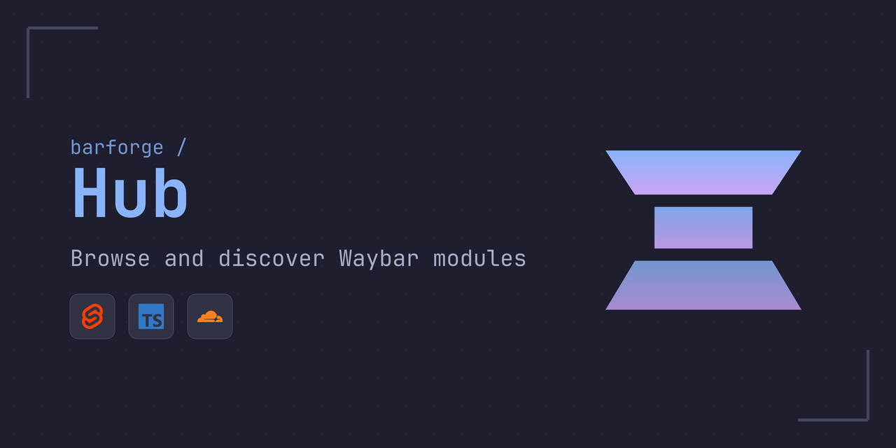
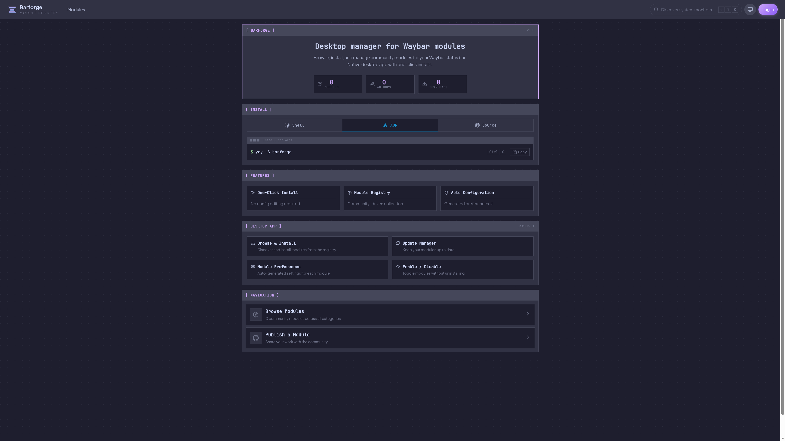

<p align="center">
  
</p>

<p align="center">
  <b>Barforge Hub — Browse and discover Waybar modules</b>
</p>

<p align="center">
  <a href="#features">Features</a> •
  <a href="#development">Development</a> •
  <a href="#deployment">Deployment</a> •
  <a href="#related">Related</a>
</p>

<p align="center">
  
  
  
</p>

---

## Screenshot

<p align="center">
  
</p>

## Features

🔍 **Browse Modules** — Discover Waybar modules from the Barforge registry

👤 **GitHub Authentication** — Sign in with GitHub to submit and review modules

⭐ **Reviews & Ratings** — Rate modules and read community feedback

📦 **Module Submissions** — Submit your own modules to the registry

🎨 **Dark Theme** — Consistent design with Barforge desktop app

## Development

### Prerequisites

- Node.js 20+
- npm or pnpm

### Setup

```bash
# Install dependencies
npm install

# Copy environment template
cp .env.example .env

# Start development server
npm run dev
```

### Environment Variables

| Variable             | Description                        |
| -------------------- | ---------------------------------- |
| `AUTH_SECRET`        | Random secret for Auth.js sessions |
| `AUTH_GITHUB_ID`     | GitHub OAuth App Client ID         |
| `AUTH_GITHUB_SECRET` | GitHub OAuth App Client Secret     |

## Deployment

This project is designed to deploy on Cloudflare Pages with D1 database.

```bash
# Build for production
npm run build

# Deploy to Cloudflare Pages
wrangler pages deploy .svelte-kit/cloudflare
```

## Related

| Project                                                  | Description                                         |
| -------------------------------------------------------- | --------------------------------------------------- |
| [barforge-app](https://github.com/jtaw5649/barforge-app) | Barforge App — Install and configure Waybar modules |
